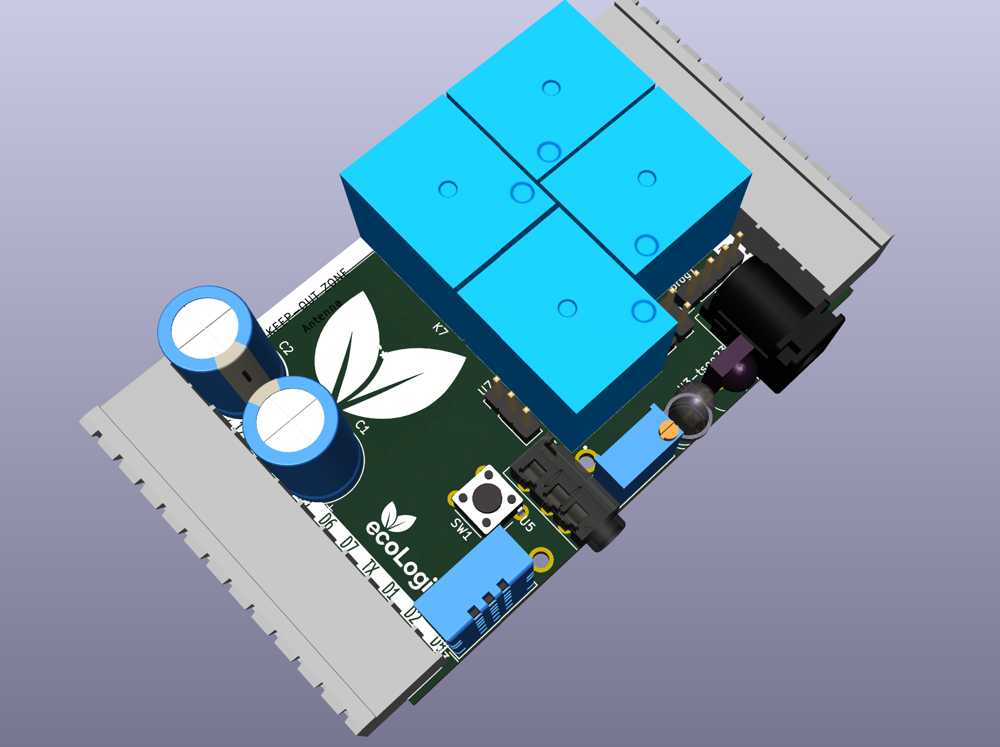

# EcoLogic KiCad - ESP8266 Home Automation PCB

A professional-grade KiCad project for ESP8266-based home automation systems, designed for JLCPCB manufacturing and Home Assistant integration.

## 📋 Project Overview

This repository contains complete PCB designs for IoT home automation controllers using ESP8266 microcontrollers. The boards are optimized for controlling lights, home appliances, and other smart devices through Home Assistant.

### Key Features
- ESP8266-based design for WiFi connectivity
- Multiple relay outputs for appliance control
- JLCPCB-ready manufacturing files
- Home Assistant compatible
- Professional PCB layout with proper isolation
- SMD components for compact design

## 🖼️ Board Images

| Schematic | PCB Layout |
|-----------|------------|
|  |  |
|  |  |

## 📁 Repository Structure

```
EcoLogic-KiCad/
├── IoTmanager/                    # Main project directory
│   ├── BOM-CPL/                   # Bill of Materials & Component Placement
│   │   ├── BOM.csv               # JLCPCB Bill of Materials
│   │   ├── CPL.xlsx              # Component Placement List
│   │   └── *.csv                 # Position files
│   ├── gerber/                    # Manufacturing files
│   │   ├── gerber.zip            # Complete gerber package
│   │   ├── *.gbr                 # Individual gerber layers
│   │   └── *.drl                 # Drill files
│   ├── images/                    # PCB and schematic images
│   ├── LCPCB/                     # JLCPCB templates
│   └── *.kicad_*                 # KiCad project files
└── README.md                      # This file
```

## 🔧 Components List

| Component | Quantity | Package | JLCPCB Part # | Description |
|-----------|----------|---------|---------------|-------------|
| ESP8266 Module | 1 | SOT-223-3 | C6186 | Main microcontroller |
| MMBT5401 (PNP) | 4 | SOT-23 | C8326 | PNP transistors |
| MMBT5551 (NPN) | 4 | SOT-23 | C2145 | NPN transistors |
| 100Ω Resistor | 5 | 0805 | C17408 | Current limiting |
| 10kΩ Resistor | 7 | 0805 | C17414 | Pull-up resistors |
| 1kΩ Resistor | 8 | 0805 | C25905 | Base resistors |

## 🏭 JLCPCB Manufacturing Guide

### Step 1: Prepare Files
1. Download the complete `gerber.zip` from `IoTmanager/gerber/`
2. Get BOM file: `IoTmanager/BOM-CPL/BOM.csv`
3. Get CPL file: `IoTmanager/BOM-CPL/CPL.xlsx`

### Step 2: Upload to JLCPCB
1. Go to [JLCPCB.com](https://jlcpcb.com/)
2. Click "Add gerber file" and upload `gerber.zip`
3. Review PCB specifications:
   - **Layers**: 2
   - **Thickness**: 1.6mm
   - **Color**: Green (recommended)
   - **Surface Finish**: HASL (lead-free)

### Step 3: SMT Assembly (Optional)
1. Enable "SMT Assembly"
2. Upload BOM file (`BOM.csv`)
3. Upload CPL file (`CPL.xlsx`)
4. Review component placement
5. Confirm parts availability

### Step 4: Order
- Minimum quantity: 5 pieces
- Typical lead time: 2-5 days (PCB only)
- SMT assembly adds 3-5 days

## 🏠 Home Assistant Integration

### ESP8266 Firmware Options
- **ESPHome** (Recommended)
- **Tasmota**
- **Arduino IDE** with custom code

### ESPHome Configuration Example
```yaml
esphome:
  name: iot-controller
  platform: ESP8266
  board: esp01_1m

wifi:
  ssid: "YourWiFi"
  password: "YourPassword"

api:
  encryption:
    key: "your-api-key"

ota:
  password: "your-ota-password"

switch:
  - platform: gpio
    pin: GPIO2
    name: "Relay 1"
    id: relay1
  - platform: gpio
    pin: GPIO4
    name: "Relay 2"
    id: relay2
```

## ⚡ Power Requirements

| Parameter | Value | Notes |
|-----------|-------|-------|
| Input Voltage | 5V DC | Via USB or external supply |
| Current Consumption | 80-200mA | Depends on relay states |
| Relay Switching | 10A @ 250V AC | Per relay channel |
| Logic Level | 3.3V | ESP8266 native |

## 🔌 Pin Configuration

| GPIO | Function | Description |
|------|----------|-------------|
| GPIO0 | Boot Mode | Pull low for programming |
| GPIO2 | Relay 1 | Output control |
| GPIO4 | Relay 2 | Output control |
| GPIO5 | Relay 3 | Output control |
| GPIO12 | Relay 4 | Output control |
| GPIO13 | Status LED | Board status indicator |
| GPIO14 | Spare I/O | Additional control |
| GPIO16 | Wake-up | Deep sleep wake |

## 🛠️ Assembly Tips

### Soldering Guidelines
- Use lead-free solder (SAC305 recommended)
- Soldering iron: 350°C for SMD components
- Use flux for better joints
- Solder ESP8266 module first

### Testing Procedure
1. **Visual Inspection**: Check for shorts and proper alignment
2. **Power Test**: Apply 5V and measure 3.3V rail
3. **Programming Test**: Upload basic blink sketch
4. **Relay Test**: Verify relay switching with multimeter

## 🚨 Safety Warnings

⚠️ **HIGH VOLTAGE WARNING**
- Relays switch mains voltage (110V/220V AC)
- Always disconnect power before wiring
- Use proper electrical enclosure
- Follow local electrical codes

⚠️ **ESD Precautions**
- Use anti-static wrist strap during assembly
- Store boards in anti-static bags
- Ground yourself before handling

## 📝 Version History

| Version | Date | Changes |
|---------|------|---------|
| v2 | 2025-07 | Improved routing, added protection circuits |
| v1 | 2025-05 | Initial release |

## 🤝 Contributing

1. Fork the repository
2. Create feature branch (`git checkout -b feature/improvement`)
3. Commit changes (`git commit -am 'Add improvement'`)
4. Push to branch (`git push origin feature/improvement`)
5. Create Pull Request

## 📄 License

This project is open-source hardware. Feel free to modify and distribute according to your needs.

## 🆘 Support

- **Issues**: Use GitHub Issues for bug reports
- **Discussions**: Use GitHub Discussions for questions
- **Email**: Contact for commercial support

## 🔗 Useful Links

- [KiCad Official Site](https://kicad.org/)
- [JLCPCB Manufacturing](https://jlcpcb.com/)
- [ESPHome Documentation](https://esphome.io/)
- [Home Assistant](https://home-assistant.io/)
- [ESP8266 Arduino Core](https://github.com/esp8266/Arduino)

---

**Made with ❤️ for the Home Automation Community**